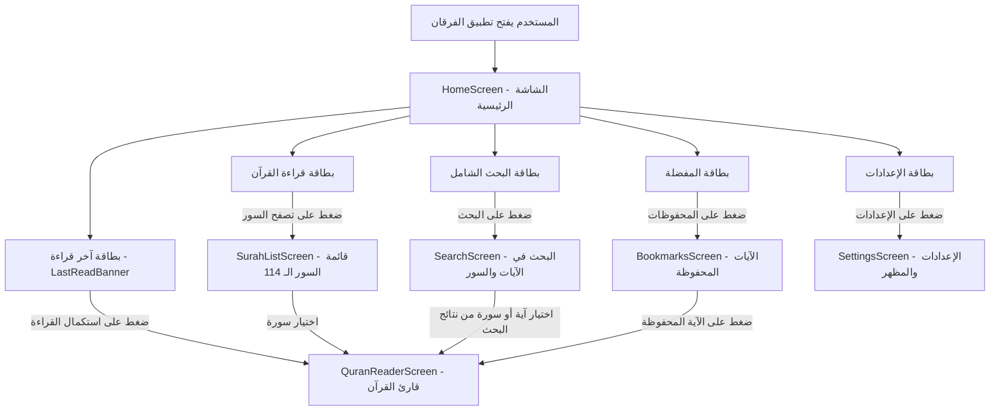
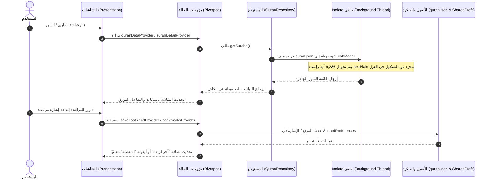

# دليل التفاعل والمعمارية — تطبيق الفرقان (Al-Furqan)

يقدم هذا المستند شرحًا مفصلاً وتفاعليًا لهيكلية تطبيق **«الفرقان»**، مع توضيح كيفية ترابط الشاشات، حركة البيانات عبر الطبقات المختلفة، وتفاعل المستخدم مع النظام من الفتح حتى القراءة والحفظ.

---

## 1. مخطط التنقل وترابط الشاشات (Page Navigation Flow)

يوضح المخطط التالي كيفية انتقال المستخدم بين شاشات التطبيق عبر نظام `go_router`:

---

## 2. مخطط حركة البيانات وإدارة الحالة (Data & State Flow)

تتبع المعمارية نمط **Clean Architecture** مع **Riverpod 3** لإدارة الحالة، وتتم معالجة البيانات دون أي تهنيج لـ UI باستخدام الـ **Isolate**:

---

## 3. تفصيل تفاعل الشاشات مع المستخدم (Screen Interactions)

### 1️⃣ الشاشة الرئيسية (`HomeScreen`)
- **الهيدر الشرفي (`QuranHeader`):** يتضمن شعار التطبيق الملكي (أيقونة المصحف الذهبية) مع اسم **«الفرقان»** وعبارة *"ابدأ رحلتك مع القرآن الكريم"*.
- **بطاقة آخر قراءة (`LastReadBanner`):** تظهر تلقائيًا عند وجود قراءة سابقة وتتيح لك العودة الفورية لآخر سورة وآية توقفت عندها بنقرة واحدة.
- **شبكة الميزات (`_HomeFeatureCard`):** 4 بطاقات تفاعلية أنيقة للانتقال السريع إلى:
  1. قراءة القرآن.
  2. البحث الشامل.
  3. الآيات المحفوظة.
  4. الإعدادات.

---

### 2️⃣ شاشة قائمة السور (`SurahListScreen`)
- **العرض السريع:** تعرض السور الـ 114 بصورة متدرجة وسريعة جداً.
- **الفلترة الفورية:** شريط بحث علوي يسمح بتصفية السور حسب:
  - اسم السورة بالعربية (مثل: *الفاتحة*، *البقرة*).
  - اسم السورة بالإنجليزية (مثل: *Al-Fatiha*).
  - رقم السورة (مثل: *1*، *114*).
- **تفاصيل كل سورة:** رقم السورة في دائرة مخصصة، نوع السورة (مكية / مدنية)، وعدد آياتها.

---

### 3️⃣ شاشة قارئ القرآن (`QuranReaderScreen`)
- **عرض نصي فاخر:** قراءة الآيات بخط **الأُميري** الإسلامي المريح للعين مع مسافات تشكيل مدروسة.
- **البسملة الفائقة:** تظهر البسملة في بداية كل سورة تلقائيًا (وتختفي في سورة التوبة).
- **التفاعل مع كل آية (`_AyahTile`):**
  - **حفظ موقع القراءة التلقائي:** أثناء التمرير، يتتبع التطبيق الآية الظاهرة ويحفظها تلقائياً لتظهر في بطاقة "آخر قراءة".
  - **إضافة للمفضلة:** زر النجمة/الإشارة المرجعية يتيح حفظ آيات مختارة بنقرة واحدة.
  - **نسخ الآية:** زر النسخ ينسخ نص الآية الكريمة مباشرة إلى الحافظة.
  - **الحجم التكيفي للخط:** ينعكس حجم الخط المحدد في الإعدادات فوراً على نص الآيات.

---

### 4️⃣ شاشة البحث الشامل (`SearchScreen`)
- **البحث الذكي المجرد:** يعتمد على حقل `textPlain` الذي أضيف للبيانات للبحث عن الكلمات **بدون تشكيل** (مثلاً: ابحث عن كلمة *"الحمد"* ليجد *"ٱلْحَمْدُ"*).
- **النتائج المزدوجة:** يعرض المطابقات في أسماء السور وكذلك في نصوص الآيات مع إبراز رقم الآية والسورة.
- **الانتقال المباشر:** عند الضغط على أي نتيجة بحث، ينتقل بك التطبيق مباشرة إلى السورة المحددة.

---

### 5️⃣ شاشة الإعدادات (`SettingsScreen`)
- **التحكم بالمظهر (Light / Dark Mode):** باستخدام مكوّن `SegmentedButton` الحديث المتوافق مع Material 3 للتنقل بين (المظهر الفاتح / المظهر الداكن / حسب نظام الجهاز).
- **التحكم بحجم الخط (Font Size Slider):** شريط سحب سلس يتيح اختيار حجم الخط من 18 إلى 36 مع **معاينة حية ومباشرة** لنص البسملة بنفس الحجم المختار.
- **بطاقة التعريف:** تعرض بيانات إصدار تطبيق **«الفرقان»**.

---

## 4. طبقات المعمارية النظيفة (Clean Architecture Layers)

| الطبقة | المكونات | الوظيفة |
|---|---|---|
| **Domain Layer** | `Surah`, `Ayah`, `QuranRepository` (Interface), `GetSurahsUseCase`, `GetLastReadUseCase` | تمثل قواعد وشفرة العمل الخالصة (Pure Logic) بدون الاعتماد على أي حزم خارجية |
| **Data Layer** | `SurahModel`, `AyahModel`, `QuranLocalDataSourceImpl`, `QuranRepositoryImpl` | مسؤولة عن جلب وفك تشفير ملف `quran.json` عبر `Isolate.run` وحفظ البيانات في `SharedPreferences` |
| **Presentation Layer** | `HomeScreen`, `SurahListScreen`, `QuranReaderScreen`, `SearchScreen`, `SettingsScreen`, `quran_provider.dart` | مسؤولة عن الواجهة، إمساك وتوزيع الحالة عبر Riverpod 3، والتفاعل البصري مع المستخدم |
